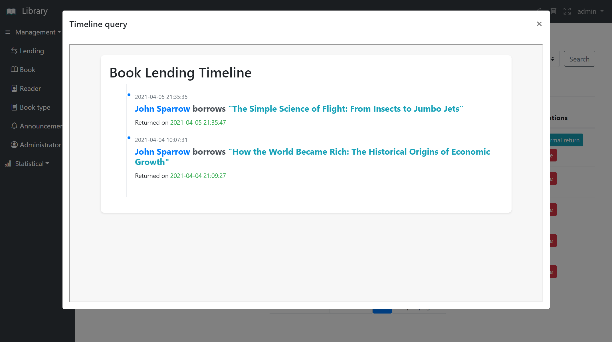

# 📚 Système de gestion de bibliothèque
*Read this in [English](README_en.md)*

## 📝 Description du projet :
Ce système de gestion de bibliothèque est une application web en Java avec Maven conçue pour simplifier la gestion d'une bibliothèque. Il offre des fonctionnalités pour les administrateurs et les lecteurs (utilisateurs).

### 🛠️ Technologies Utilisées
- Base de données : [MySQL](library.sql)
- IDE : Intellij IDEA
- Pool de connexions de données : [Druid](https://github.com/alibaba/druid/wiki/FAQ)
- Conteneur Web : [Apache Tomcat](https://tomcat.apache.org/)
- Outils de gestion de projet : [Maven](pom.xml)
- Outils de contrôle de versions : Git
- Technologie back-end : [Spring](src/main/resources/spring.xml) + [SpringMVC](src/main/resources/springmvc.xml) + [MyBatis](src/main/resources/generatorConfig.xml)
- Framework front-end : [bootstrap](https://getbootstrap.com/)

### 💼 Fonctionnalités pour l'administrateur :
- 🔐 Authentification : L'administrateur doit se connecter à l'aide d'un nom d'utilisateur, d'un mot de passe et d'un code de vérification.
- 📋 Gestion des prêts : L'administrateur peut consulter la liste des prêts, faire un prêt pour le lecteur, modifier le statut d'un prêt(en cours de prêt, retourné, perdu, etc.), c'est-à-dire rendre un livre.
- 📚 Gestion des livres : L'administrateur peut consulter la liste des livres, ajouter de nouveaux livres, modifier les informations des livres existants et supprimer des livres.
- 👥 Gestion des utilisateurs : L'administrateur peut consulter la liste des utilisateurs, modifier leurs informations et supprimer des utilisateurs.
- 🏷️ Gestion des types de livres : L'administrateur peut consulter la liste des types de livres, ajouter de nouveaux types et supprimer des types.
- 📢 Gestion des annonces : L'administrateur peut faire une annonce si souhaitée.
- 📊 Statistiques : L'administrateur peut consulter des statistiques sur les livres par type.
- 👑 Il y a deux catégories d'administrateurs : Senior et Ordinaire. Les administrateurs seniors ont la capacité de gérer les administrateurs, tandis que les administrateurs ordinaires ne peuvent pas.

### ‍🎓 Fonctionnalités pour les lecteurs
- 🔐 Authentification : Les lecteurs doit se connecter à l'aide d'un nom d'utilisateur, d'un mot de passe et d'un code de vérification.
- ✏️ Les utilisateurs peuvent modifier leurs informations personnelles ainsi que leur mot de passe.
- 🔍 Recherche de livres : Les utilisateurs peuvent rechercher des livres par titre, auteur, genre.
- 📘 Consultation des informations d'un livre : Les utilisateurs peuvent consulter les informations d'un livre, telles que le titre, l'auteur, le genre, et la disponibilité, etc.
- 📆 Consulter les prêts personnels : Les utilisateurs peuvent regarder leur chronologie d'emprunt de livres.
- 📢 Consulter les annonces.
- 🔑 Chaque lecteur possède un mot de passe `123456` par défaut au début, ils peuvent le modifier eux-mêmes.

### 📖 Guide de Configuration
Pour faciliter la mise en place et l'utilisation de notre système, nous avons préparé un guide de configuration détaillé. Ce guide fournit des instructions pas à pas sur la manière de configurer l'environnement de développement, d'installer les dépendances nécessaires, et de configurer la base de données.

- Vous pouvez accéder au guide de configuration en cliquant sur le lien 🔧 [Guide de Configuration du Projet](configuration.pdf)

### 🚀 Tester le projet
Pour vous permettre de tester facilement notre système de gestion de bibliothèque, nous avons mis en place deux comptes d'exemple : un compte administrateur et un compte lecteur. Voici les détails de connexion pour chaque compte :
##### Compte Administrateur
- **Nom d'utilisateur** : `admin`
- **Mot de passe** : `12345`

Avec ce compte, vous aurez accès à toutes les fonctionnalités d'administration, telles que la gestion des livres, des prêts, des annonces, et des utilisateurs.
##### Compte Lecteur
- **Nom d'utilisateur** : `john`
- **Mot de passe** : `12345`

En tant que lecteur, ce compte vous permet de rechercher des livres, consulter des informations sur les livres, et voir votre historique de prêts.

### ⚙️ Sécurité des Mots de Passe

Dans le cadre de ce projet d’exercice, et pour en simplifier les aspects techniques, nous n’avons pas implémenté le cryptage des mots de passe côté back-end. Il est important de noter que dans un environnement de production réel, il serait impératif de stocker les mots de passe sous une forme sécurisée en utilisant des méthodes de hachage et de salage appropriées. Ce choix est dicté par la volonté de se concentrer sur les autres aspects de la gestion de la bibliothèque dans le cadre d'apprentissage de ce projet. Pour plus d’informations sur la mise en œuvre d’un hachage et salage de mots de passe sécurisé en Java, vous pouvez consulter [ce guide complet](https://howtodoinjava.com/java/java-security/how-to-generate-secure-password-hash-md5-sha-pbkdf2-bcrypt-examples/).

### 📸 Quelques captures d'écran de projet
- #### Page de connexion

- #### Page d'accueil

- #### Page de gestion des prêts

- #### Chronologie du prêt

- #### Page de profil d'un lecteur

- #### Page de livre d'un lecteur

## ⚖️ Licence 
Ce projet est distribué sous la [Licence Publique Générale GNU version 3 (GPLv3)](LICENSE).

Pour plus de détails, veuillez consulter le fichier [LICENSE](LICENSE) à la racine de ce projet.

