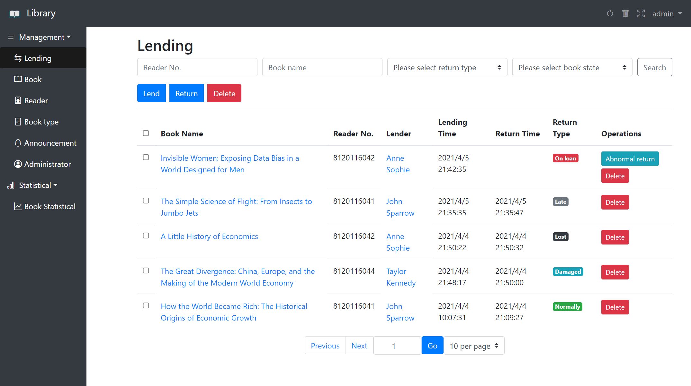
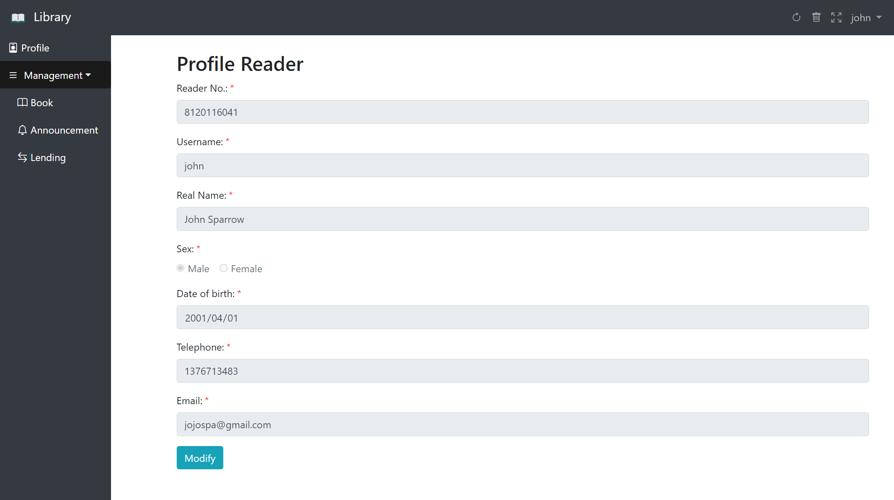
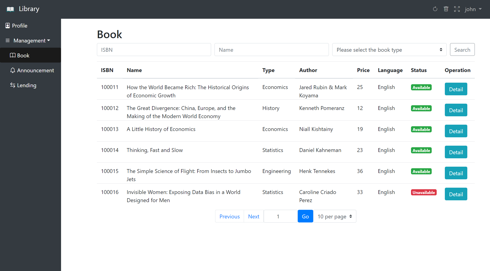

# 📚 Library Management System
*Lisez ceci en [Français](README.md)*

## 📝 Project Description:
This library management system is a web application in Java with Maven designed to simplify the management of a library. It offers features for administrators and readers (users).

## 🛠️ Technologies Used
- Database: [MySQL](library.sql)
- IDE: Intellij IDEA
- Data connection pool: Druid
- Web container: Apache Tomcat
- Project management tools: [Maven](pom.xml)
- Version control tools: Git
- Back-end technology: [Spring](src/main/resources/spring.xml) + [SpringMVC](src/main/resources/springmvc.xml) + [MyBatis](src/main/resources/generatorConfig.xml)
- Front-end framework：bootstrap

### 💼 Features for the administrator:
- 🔐 Authentication: The administrator must log in using a username and password.
- 📋 Loan management: The administrator can view the list of loans, make a loan for the reader, modify the status of a loan (in progress, returned, lost, etc.), that is, return a book.
- 📚 Book management: The administrator can view the list of books, add new books, modify the information of existing books, and delete books.
- 👥 User management: The administrator can view the list of users, modify their information, and delete users.
- 🏷️ Management of book types: The administrator can view the list of book types, add new types, and delete types.
- 📢 Announcement management: The administrator can make an announcement if desired.
- 📊 Statistics: The administrator can view statistics on books by type.
- 👑 There are two categories of administrators: Senior and Ordinary. Senior administrators have the ability to manage administrators, while ordinary administrators cannot.

### 👨‍🎓 Features for the readers
- 🔐 Authentication: Readers must log in using a username and password.
- ✏️ Users can modify their personal information as well as their password.
- 🔍 Book search: Users can search for books by title, author, genre.
- 📘 Viewing a book's information: Users can view the information of a book, such as the title, author, genre, and availability, etc.
- 📆 View personal loans: Users can look at their book borrowing timeline.
- 📢 View announcements.

### 📖 Configuration Guide
To facilitate the setup and use of our system, we have prepared a detailed configuration guide. This guide provides step-by-step instructions on how to set up the development environment, install the necessary dependencies, and configure the database.

- You can access the configuration guide by clicking the link 🔧 [Project Configuration Guide](configuration.pdf)

### 🚀 Test the Project
To enable you to easily test our library management system, we have set up two example accounts: an administrator account and a reader account. Here are the login details for each account:
#### Administrator Account
- **Username**: `admin`
- **Password**: `12345`

With this account, you will have access to all the administrative features, such as managing books, loans, announcements, and users.
#### Reader Account
- **Username**: `john`
- **Password**: `12345`

As a reader, this account allows you to search for books, view information about the books, and see your loan history.

### 📸 Some project screenshots
- #### Login Page

- #### Home Page

- #### Lending Management Page

- #### Reader Profile Page

- #### Reader's Book Page

